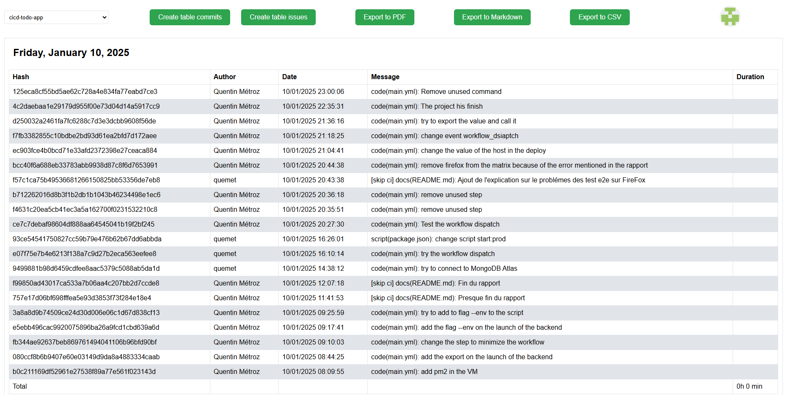

# **script-git-commit**

> Cette application à pour but de pouvoir utiliser les commits comme journal de travail et de pouvoir exporter ses commmits ou issues. L'application sert surtout pour les rapports de projets.

---

## **Table des Matières**
1. [Aperçu](#aperçu)
2. [Fonctionnalités](#fonctionnalités)
3. [Technologies Utilisées](#technologies-utilisées)
4. [Prérequis](#prérequis)
5. [Installation](#installation)
6. [Utilisation](#utilisation)
7. [Tests](#tests)
8. [Contributeurs](#contributeurs)
9. [Licence](#licence)
10. [Contact](#contact)

---

## **Aperçu**

* ### Login 


* ### Repo picker


* ### Commits table



* ### Issues table


---

## **Fonctionnalités**

* Connexion avec l'api de GitHub
* Vue des commits d'un repo
* Vue des issues d'un repo
* Exporter en pdf les commits/issues d'un repo
* Exporter en csv les commits/issues d'un repo
* Exporter en md les commits/issues d'un repo

---

## **Technologies Utilisées**

* ### Language :


* ### Outils :


---

## **Prérequis**

Voici les outils nécessaire au projet :

- Node.js
- Git

---

## **Installation**

### Étape 1 : Cloner le dépôt
```bash
git clone https://github.com/quemet/script-git-commit.git
cd script-git-commit
```

### Étape 2 : Installer les dépendances
```bash
npm install
```

### Étape 3 : Configurer les variables d'environnement

- Créez un fichier `.env` à la racine avec le script dans le dossier script :

```sh
sh script/setup-env.sh <DB_USER> <DB_PASSWORD> <DB_HOST> <DB_PORT> <DB_NAME>
```

- Crée un fichier env.js dans le dossier public/ comme ceci :

Si vous avez le CLIENT_ID et CLIENT_SECRET de GitHub OAuth app

```js
const CLIENT_ID = "<votre client_id>"
const CLIENT_SECRET = "<votre client_secret>"

export { CLIENT_ID, CLIENT_SECRET }
```

### Étape 4 : Lancer l'application

```bash
npm run start:dev
```

---

## **Utilisation**

Pour utiliser l'application :

* Allez sur `http://localhost:8000`
* Connectez-vous avec votre compte github et amusez-vous !

---

## **Tests**

* ### Test unitaires

!!! Pas encore implémenté !!!

* ### Test e2e

- Instructions pour exécuter les tests :

```sh
npm test:e2e:dev
```

- Mentionnez les outils ou frameworks de tests utilisés (par exemple, Jest, Cypress).

J'ai utilisé Cypress.

---

## **Issues**

Lors de la connexion si vous êtes bloqué, connectez vous polusierus fois jusqu'à que vouss aviez la page de connection de github. Allez dans les cookies de la page et supprimmer l'entrée user_section.

## **Contributeurs**

- Contributerus 1


---

## **Licence**

Ce projet est sous license MIT. Voir le fichier `LICENSE` pour en savoir plus.

---

